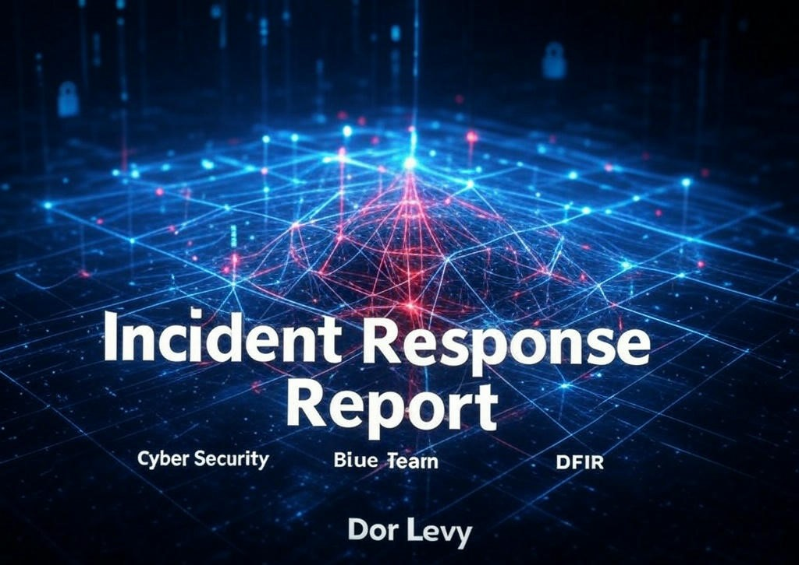

## **Incident Response and Walkthrough of the Blue Team Lab from CyberDefenders**

**Made by Dor Levy**

This report provides a **comprehensive incident response analysis** and a **step-by-step walkthrough** of the **Blue Team Lab from CyberDefenders**, focusing on forensic investigation, threat detection, Malware analysis, and remediation strategies.

[intro](intro.md)

[Executive Summary](Executive%20Summary.md)

[System Information](System%20Information.md)

[Forensic Analysis](Forensic%20Analysis.md)

[MITRE ATT&CK](MITRE%20ATT&CK.md)

[IOC'S](IOC'S.md)

[Lab](https://cyberdefenders-org.webpkgcache.com/doc/-/s/cyberdefenders.org/blueteam-ctf-challenges/spottedinthewild/)
